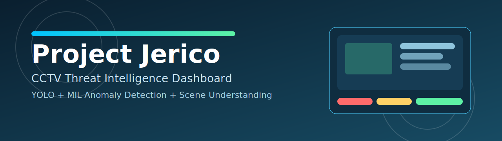
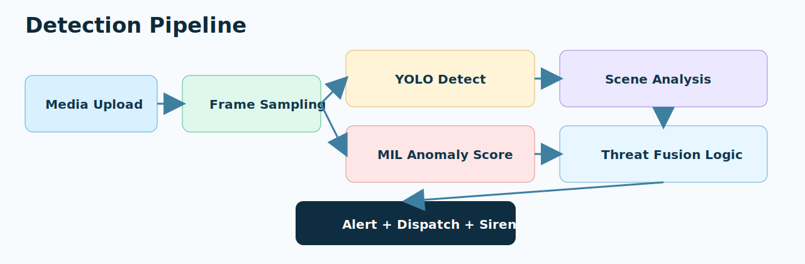
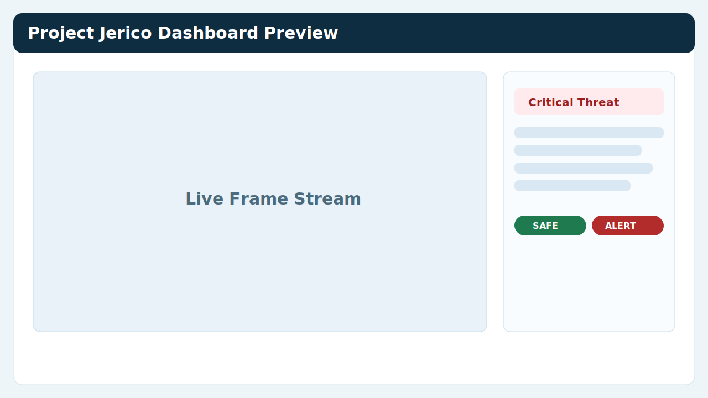

<h1 align="center">Project Jerico</h1>

<p align="center">AI-powered CCTV threat analytics for rapid detection, context understanding, and security response support.</p>

<p align="center">
   
</p>

<p align="center">
  
  
  
  
  
  
  
  
</p>

## Project Idea

Project Jerico is designed as an intelligent surveillance assistant for security teams that need faster and more reliable incident awareness from CCTV media. The platform is built around a practical principle: a single model output is rarely enough for high-confidence decisions in real-world security operations. Lighting changes, camera angles, occlusions, and crowded scenes can all reduce reliability when one detector is used alone.

To address this, Jerico combines multiple evidence channels and fuses them into one operational threat decision. Instead of relying only on object detection or only on behavior analysis, the system correlates:

1. Visual object evidence (person/weapon)
2. Temporal anomaly evidence (violence or abnormal pattern across time)
3. Scene context evidence (semantic understanding of what is happening)

This multi-model approach reduces blind spots, improves trust in alerts, and provides operators with richer decision context before escalation.

## Executive Summary

Project Jerico is a client-ready intelligent surveillance platform that analyzes uploaded CCTV image and video data to identify suspicious activity, potential violence, and threat indicators. It provides a unified monitoring experience through a web dashboard, where users can upload media, review detections, inspect contextual cues, and see consolidated threat outputs in near real time.

It combines:

1. Object detection for people and weapons
2. Temporal anomaly scoring for violent or abnormal behavior
3. Scene understanding for semantic context

When a high-risk event is identified, the dashboard raises a critical alert, activates siren output, and generates geo-tagged dispatch information to support rapid field response.

## How It Works

<p align="center">
   
</p>

Project Jerico follows a staged detection and decision pipeline that mirrors practical security workflows.

1. Media Intake
   - The operator uploads image or video evidence through the Streamlit interface.
   - The system validates media type and initializes processing based on whether the input is a still image or a video stream.

2. Frame-Level Analysis
   - Each frame is analyzed by the YOLO-based detection layer to identify people and potential weapons.
   - Confidence thresholds are applied to keep detections operationally meaningful.

3. Temporal Behavior Analysis
   - For supported videos, the MIL anomaly model evaluates 32 temporal segments to estimate abnormal or violent activity trends.
   - This gives the system a behavioral signal beyond single-frame object presence.

4. Scene Understanding
   - CLIP compares sampled frames against threat-oriented and normal-scene prompts to classify contextual risk.
   - This semantic layer helps interpret intent-like context, not just object existence.

5. Threat Fusion
   - The system combines object confidence, anomaly score, motion cues, and scene context into a unified threat state.
   - Smoothing logic is used to reduce unstable one-frame spikes.

6. Alert and Dispatch Output
   - On high-risk detection, the dashboard raises a critical alert, generates siren output, and formats location-aware dispatch details.
   - Operators receive clear visibility into why the threat state was triggered.

## Business Value

1. Faster threat awareness for security operators
2. Improved incident response readiness
3. Reduced blind spots through multi-signal analysis
4. Clear operational visibility through a single dashboard

From an operational perspective, Jerico helps teams shift from reactive CCTV review to proactive incident intelligence. By layering object, behavior, and context signals, the platform helps prioritize critical events sooner and reduce ambiguity during active monitoring windows.

## Key Capabilities

1. Image and video upload analysis
2. Real-time-style frame threat inference in the dashboard
3. Weapon/person detection via YOLO-based models
4. Anomaly detection via MIL scoring over segment features
5. CLIP-based scene interpretation
6. Threat-state fusion logic and critical alert display
7. Dispatch message generation with location context

## Detailed Tech Stack

1. Python
   - Primary language for orchestration, model execution, dashboard logic, and data handling.

2. Streamlit
   - Client-facing web application layer for upload, analytics display, threshold controls, and alert visualization.

3. OpenCV
   - Video decoding, frame extraction, image conversion, and rendering utilities used by the processing pipeline.

4. PyTorch
   - Deep learning runtime for the MIL anomaly model and tensor-based inference/training operations.

5. Ultralytics YOLO
   - Object detection engine used to identify persons and weapon-like objects in frames.

6. Transformers (CLIP)
   - Scene-level semantic understanding by matching frame content against threat and normal-language prompts.

7. NumPy
   - Numerical backbone for feature manipulation, array transforms, and preprocessing.

8. SciPy
   - Siren waveform support and related audio utility functions used during threat alert generation.

These technologies are intentionally selected to balance research-grade AI capability with deployment practicality. Streamlit simplifies delivery for operator teams, while PyTorch and YOLO provide scalable model performance and extensibility.

## Solution Architecture

```text
Input Layer
  -> Media Upload (image/video)

Perception Layer
  -> Frame Processing (OpenCV)
  -> Object Detection (YOLO)
  -> Scene Understanding (CLIP)

Behavior Layer
  -> Temporal Feature Lookup
  -> MIL Anomaly Scoring (32 segments)

Decision Layer
  -> Confidence Thresholding
  -> Motion and Context Fusion
  -> Threat State Resolution

Response Layer
  -> Critical Alert Rendering
  -> Siren Activation
  -> Geo-tagged Dispatch Message
```

The architecture separates perception, behavior analysis, decision logic, and response output so each layer can evolve independently. This modular design supports future model upgrades, connector integrations, and deployment customization without reworking the full pipeline.

## Architecture Components

1. Presentation Layer
   - `src/dashboard.py`
   - Responsible for operator interaction, controls, and result visualization.

2. Detection Layer
   - `src/detect.py`
   - Executes person and weapon inference using YOLO models.

3. Anomaly Layer
   - `src/detect_anomaly.py`
   - Loads trained MIL weights and predicts segment-level anomaly probabilities.

4. Scene Intelligence Layer
   - `src/scene_understanding.py`
   - Performs text-guided contextual interpretation of scene content.

5. Alerting Layer
   - `src/alert.py`
   - Builds actionable dispatch text and supports siren generation.

6. Training Layer
   - `src/train_ucf_crime.py`
   - Trains and checkpoints the anomaly model from UCF-style feature datasets.

## Project Structure

```text
PROJECT-JERICO-main/
├── README.md
├── requirements.txt
├── run.bat
├── run.sh
├── config.py
├── launcher_utility.py
├── yolov8n.pt
├── models/
│   ├── best_anomaly_model.pth
│   └── gun_bestweight.pt
├── docs/images/
│   ├── banner.svg
│   ├── dashboard-preview.svg
│   └── pipeline.svg
└── src/
    ├── dashboard.py
    ├── detect.py
    ├── detect_anomaly.py
    ├── scene_understanding.py
    ├── alert.py
    ├── ingest.py
    ├── threat_logic.py
    └── train_ucf_crime.py
```

## Setup

### 1. Create and Activate Virtual Environment

macOS/Linux:

```bash
python -m venv .venv
source .venv/bin/activate
```

Windows PowerShell:

```powershell
python -m venv .venv
.venv\Scripts\Activate.ps1
```

### 2. Install Dependencies

```bash
pip install -r requirements.txt
```

## Run the Application

```bash
./run.sh
```

Windows:

```bat
run.bat
```

Recommended Python version: 3.10 to 3.12.
Using Python 3.14+ can cause module availability gaps for the current torch/scipy stack.

Open the local URL printed in terminal (default: http://localhost:8501).

## Operating Flow

<p align="center">
   
</p>

1. Open dashboard
2. Configure confidence thresholds if needed
3. Upload image or video evidence
4. Review detections, anomaly score, and scene context
5. Monitor generated alert and dispatch details for high-risk events

This flow is designed for operational simplicity: the user only needs to upload media and review consolidated outputs, while the system handles multi-stage AI processing in the background.

## Detection Logic Summary

1. Threat can be triggered by one strong signal (for example confirmed weapon) or by consistent multi-signal evidence.
2. Scene interpretations are sampled over time and smoothed to avoid unstable one-frame decisions.
3. Motion behavior and anomaly trends are used to improve confidence before escalation.
4. Final output is presented as a clear security status with actionable dispatch context.

In practical usage, this means Jerico does not depend on a single frame or isolated probability. It tracks consistency and context over time to improve confidence and reduce noisy escalation.

## Model Assets

1. Person/base detector: `yolov8n.pt`
2. Weapon detector: `models/gun_bestweight.pt`
3. Anomaly model: `models/best_anomaly_model.pth`

## Training

To retrain anomaly scoring model:

```bash
python src/train_ucf_crime.py
```

Expected dataset path:

```text
DATASET/
├── Anomaly_Train.txt
├── Normal_Train.txt
└── Features/
```

## Deliverable Scope

Project Jerico delivers an operational AI surveillance dashboard for threat analytics, alert visualization, and dispatch support suitable for pilot deployments, demonstrations, and security workflow integration. It is structured to support staged rollout, model iteration, and enterprise-facing presentations where clarity of architecture and decision flow is essential.
